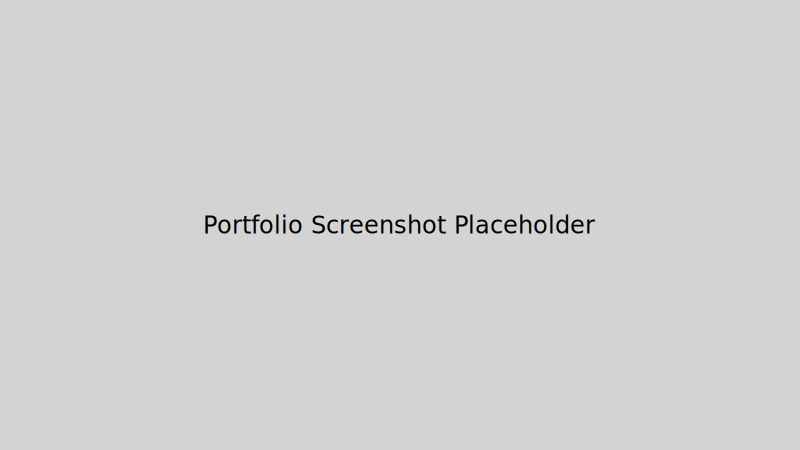

# Portfolio

A simple personal portfolio built with Next.js and Tailwind CSS.

## Purpose

Showcases projects and work experience in a clean, responsive design.

## Tech Stack

- **Next.js** with React
- **TypeScript**
- **Tailwind CSS** for styling
- **Framer Motion** for animations
- **Lucide React** for icons

## Running Locally

```bash
npm install && npm run dev
```

Visit `http://localhost:3000` in your browser.

## Updating Content

Project and experience data are stored in [`pages/index.tsx`](pages/index.tsx). Update the `projects` and `experience` arrays there. Add or replace your résumé file in the `public` folder and link to it from the page if desired.

## Preview



